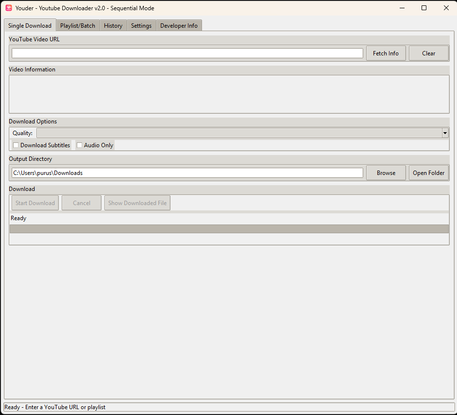
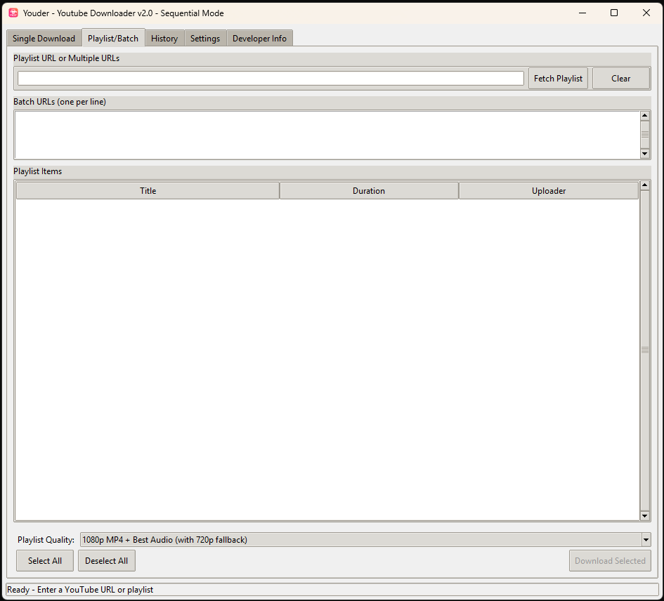
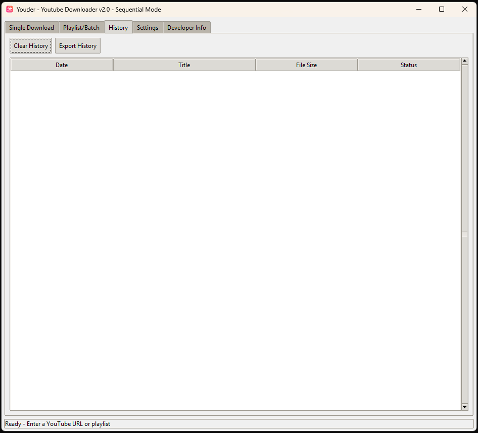
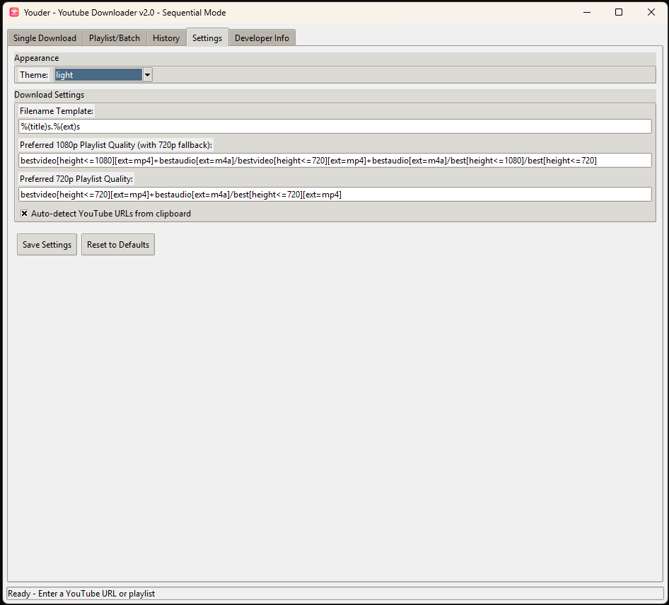

# Youder - YouTube Downloader v2.0

**Youder** is a feature-rich, GUI-based YouTube downloader built with **Python** and **Tkinter**, powered by [yt-dlp](https://github.com/yt-dlp/yt-dlp).  
It supports **single videos, playlists, batch downloads, quality selection, subtitles, themes, clipboard detection, and download history**.

---

## ✨ Features

- 🎥 **Single Video Download** with detailed video info (title, uploader, duration, size, thumbnail)
- 📂 **Playlist & Batch Downloads** with quality presets (1080p, 720p, audio only, etc.)
- 🖼 **Thumbnail Preview** before downloading
- 🎯 **Custom Quality Selection** (auto, ≤1080p, ≤720p, ≤480p, audio only)
- 📝 **Download History** with export to JSON
- 📋 **Clipboard Monitoring** to auto-detect YouTube URLs
- 🎭 **Light/Dark Theme** support
- 🎶 **Audio-Only Downloads** (MP3)
- 🏷 **Subtitle Download & Embedding**
- 🔍 **Open Downloaded File** directly from the app
- ⚙ **Custom Filename Templates**
- 💻 Cross-platform (Windows, macOS, Linux)

---

## 📦 Requirements

- **Python 3.8+**
- **yt-dlp** (for downloading videos)
- **Pillow** (for thumbnail images)
- **Requests** (for network requests)

Install dependencies with:
```bash
pip install yt-dlp pillow requests
```

---

## 🚀 Installation & Usage

1. **Clone the repository**:
   ```bash
   git clone https://github.com/yourusername/youder.git
   cd youder
   ```

2. **Install dependencies**:
   ```bash
   pip install -r requirements.txt
   ```

3. **Run the application**:
   ```bash
   python youder_v4.py
   ```

---

## 🖱 How to Use

### Single Download
1. Paste a YouTube video URL into the **Single Download** tab.
2. Click **Fetch Info** to view details.
3. Select the desired **quality** and **options** (subtitles/audio only).
4. Click **Start Download**.

### Playlist / Batch
1. Enter a playlist URL or multiple URLs (one per line).
2. Click **Fetch Playlist**.
3. Select items and choose a **playlist quality preset**.
4. Click **Download Selected**.

### Settings
- Change **theme** (light/dark).
- Set custom **filename templates**.
- Edit preferred playlist quality formats.
- Toggle **auto-detect clipboard URLs**.

---

## 📷 Screenshots

### 🎯 Main Interface - Single Download


### 📂 Playlist Tab


### 🗂 Download History


### ⛏️ Settings


---

## 🎬 Demo

Here’s a quick demo of Youder in action:


---

## 📁 File Structure

```
youder/
│
├── youder_v2.py                # Main application script
├── downloader_settings.json    # Saved settings (auto-created)
├── download_history.json       # Download history (auto-created)
├── app_icon.ico                 # App icon (auto-downloaded if missing)
├── screenshots/                # Images & demo GIFs
│   ├── single_download.png
│   ├── playlist.png
│   ├── history.png
│   ├── settings.png
│   └── demo.gif
└── README.md                   # Project documentation
```

---

## 🛠 Developer Info

- **Author:** [PurushothMathav](https://github.com/PurushothMathav)
- **Version:** 2.0
- **License:** © 2025 All rights reserved.

---

## ⚠️ Disclaimer

Downloading copyrighted videos without permission may violate local laws and YouTube's terms of service.  
Use this tool responsibly for personal or authorized purposes only.

---
